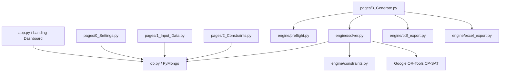

# AI Repository Context — Timetable Generator

## 1. Repository Purpose

The **Timetable Generator** is a Python-based web application for academic institutions (specifically designed for Computer Science & Engineering departments). It automates the generation of clash-free, constraint-compliant weekly class timetables for student sections and faculty members using **Google OR-Tools CP-SAT (Constraint Programming - Satisfiability)**.

Key capabilities:
- **Dual-Sheet Excel Parser**: Imports `Faculty_Assignments` (two-row header) and `Courses` (single-row header) from `.xlsx` files.
- **Interactive Constraint Builder**: Configures Open Electives (OE), Ability Enhancement Courses (AEC), PG Shared Core/Electives, Maths slot locks, 1st/2nd sem CSE Lab allocations, and 1st Sem Class Blocking.
- **CP-SAT Constraint Engine**: Enforces 17 hard constraints (no clashes, contiguous student schedules, morning-first filling, room availability, Friday half-day & 7th sem Thu/Fri off, faculty breaks, workload limits, 1st sem class locks) and 1 soft objective penalty (co-faculty subject preference).
- **Pre-flight Feasibility Checker**: Identifies structural overloads (e.g. >35 slots/week per section) before invoking the expensive solver.
- **Infeasibility Diagnostics**: Multi-pass IIS diagnostic finder when constraints conflict.
- **Export & Storage**: Color-coded PDF (ReportLab) and Excel (openpyxl) exports; stores timetables and settings in MongoDB.

---

## 2. System Architecture & Components

```
Timetable-Generator/
├── app.py                      # Streamlit entry point & dashboard metric summary
├── config.py                   # Environment variable loader (.env) for MONGO_URI & DB_NAME
├── db.py                       # PyMongo client management, MongoDB CRUD & setting fallbacks
├── requirements.txt            # Dependency specs (streamlit, pymongo, ortools, reportlab, openpyxl, pandas)
├── engine/
│   ├── __init__.py             # Package marker
│   ├── solver.py               # Main solver pipeline, mapping builders, callback & IIS diagnostics
│   ├── constraints.py          # Hard (H1–H16) and soft (S1) CP-SAT constraint definitions
│   ├── preflight.py            # Fast pre-solve structural validator
│   ├── pdf_export.py           # ReportLab PDF generation for section & faculty timetables
│   └── excel_export.py         # openpyxl formatted Excel workbook exporter
├── pages/
│   ├── 0_Settings.py           # Section structure, academic year, and solver default parameters
│   ├── 1_Input_Data.py         # Excel file uploader, parser, cross-validator, and DB persister
│   ├── 2_Constraints.py        # OE, AEC, PG shared rules, Maths lock editor, CSE lab room allocs, 1st Sem Class Blocking
│   └── 3_Generate.py           # Preflight runner, async solver invoker, grid UI, diffs & downloads
└── .github/workflows/
    └── deploy-to-render.yml    # GitHub Actions workflow triggering Render deployment webhook
```

### Component Architecture Model



---

## 3. Critical End-to-End Execution Paths

### Path 1: Data Ingestion & Cross-Validation Flow
1. User navigates to [1_Input_Data.py](file:///c:/Users/Sagar/Desktop/Timetable-Generator/pages/1_Input_Data.py), selects **Odd** or **Even** semester, and uploads `.xlsx`.
2. `parse_faculty_sheet()` locates header row containing `Sr No.`, `Name`, `Designation` and extracts subject/lab pairs across columns starting from column 3.
3. `parse_courses_sheet()` reads single-row header and maps `L`, `T`, `P`, `lecture_in_lab`, `tutorial_in_lab`, `semester`, `elective`, `aec`, `ug_pg`.
4. Codes in `Faculty_Assignments` are cross-referenced against `Courses`; unmatched codes produce UI warnings without blocking execution. Duplicate names/codes block execution (`st.stop()`).
5. User saves records; saved to MongoDB (`courses`, `faculty_odd`, `faculty_even`).

### Path 2: Constraint Mapping & Grouping Flow
1. User navigates to [2_Constraints.py](file:///c:/Users/Sagar/Desktop/Timetable-Generator/pages/2_Constraints.py).
2. Page queries `courses` collection and automatically detects OE (Sem 5–7 electives) and AEC (Sem 3–4 AEC courses).
3. User specifies/overrides OE/AEC lists, sets PG Shared Core course, configures Maths Slot Locks grid, CSE Lab Room allocations, and 1st Sem Class Blocking.
4. Saved to `constraints` collection (`type: "special_subjects"`).

### Path 3: Pre-flight & Pre-solve Transformation Flow
1. User navigates to [3_Generate.py](file:///c:/Users/Sagar/Desktop/Timetable-Generator/pages/3_Generate.py) and clicks **Generate Timetable**.
2. `run_preflight()` in [engine/preflight.py](file:///c:/Users/Sagar/Desktop/Timetable-Generator/engine/preflight.py) verifies:
   - Total scheduled events per section $\le 35$ slots/week.
   - No duplicate Maths slot lock entries.
   - Flags missing faculty assignments as warnings.
3. `build_and_solve()` in [engine/solver.py](file:///c:/Users/Sagar/Desktop/Timetable-Generator/engine/solver.py) runs in a background thread:
   - `_load_data()` fetches documents from MongoDB.
   - `_build_mappings()` expands semester-level assignments round-robin to sections via `_sections_for_semester()`.
   - `group_parallel_electives()` merges multiple electives in a semester into pseudo-courses (`CSOE_SEMx`, `CSAEC_SEMx`).
   - **Institutional OE Cleanup**: If a CSE faculty is assigned to an OE course across majority of sections in a semester, the assignment is removed from that faculty to prevent an unresolvable concurrency clash.
   - Adds virtual `"MATHS"` course for sections with maths locks.

### Path 4: Solver Model Construction, Solution Extraction & IIS Diagnosis
1. `_create_variables()` creates:
   - `x1`: Lecture BoolVars `(sec, cc, d, t)` for 7 slots.
   - `x2`: 2-slot block BoolVars `(sec, cc, etype, d, t)` for valid block starts `[0, 2, 4, 5]`.
   - `co_fac`: Co-faculty BoolVars created ONLY for eligible non-primary faculty on practical blocks.
2. Constraints attached from [engine/constraints.py](file:///c:/Users/Sagar/Desktop/Timetable-Generator/engine/constraints.py):
   - **Padded Intervals (H1 + H6)**: Lecture intervals have `duration=2` and block intervals have `duration=3`. `model.AddNoOverlap()` on padded intervals enforces both no double-booking and mandatory 1-slot faculty break simultaneously.
   - Hard rules (H1–H16, including H10.5 1st Sem Class Blocking) such as subject spread, no 9:00 AM repeat, morning-first filling, lab room symmetry breaking, workload caps, and Thursday/Friday off for 7th sem.
   - Soft objective penalty: `100 * sum(mismatch_vars)` for co-faculty assigned to courses they do not normally teach. Minimization requested via `model.Minimize()`.
3. `solver.Solve(model, callback)` runs CP-SAT solver with `_TimetableProgressCallback` streaming live log updates to UI.
4. If **OPTIMAL** or **FEASIBLE**:
   - `_extract_solution()` builds 5x7 2D timetable grids for sections & faculty and calculates workload percentages.
   - Persisted to MongoDB `timetables` collection via `save_timetable_result()`.
5. If **INFEASIBLE**:
   - `_generate_infeasibility_hints()` executes up to 3 diagnostic sub-solves with relaxed constraint subsets (`_skip_constraints`) to isolate the conflicting constraint group.

---

## 4. Data Model & Persistence

### MongoDB Collections

- **`courses`**:
  - `course_code` (str): Unique course identifier (e.g. `24CS32`)
  - `course_name` (str): Full course title
  - `L` (int): Weekly lecture hours
  - `T` (int): Weekly tutorial hours (1 block = 2 slots)
  - `P` (int): Weekly practical hours (1 block = 2 slots)
  - `lecture_in_lab` (str): `"Yes"` or `"No"`
  - `tutorial_in_lab` (str): `"Yes"` or `"No"`
  - `semester` (str): Target semester (e.g. `"3"`)
  - `elective` (str): `"Yes"` or `"No"`
  - `aec` (str): `"Yes"` or `"No"`
  - `ug_pg` (str): `"UG"` or `"PG"`

- **`faculty_odd` / `faculty_even`**:
  - `sl_no` (int/str): Serial number
  - `name` (str): Unique faculty name
  - `designation` (str): `"Professor"`, `"Associate Professor"`, or `"Assistant Professor"`
  - `semester` (str): `"odd"` or `"even"`
  - `subjects` (list[dict]): `[{"code": "CS301", "semester": "3"}]`
  - `labs` (list[dict]): `[{"code": "CS391", "semester": "3A"}]`

- **`constraints`** (`type: "special_subjects"`):
  - `open_electives` (list[str]): Course names/codes for OE
  - `aec` (list[str]): Course names/codes for AEC
  - `pg_shared_core` (str|None): Shared core course for PG SP-1/SP-2
  - `maths_slots` (list[dict]): `[{"Class": "3A", "Day": "Monday", "Slot": "S2 (...)", "Faculty": "MATHS"}]`
  - `cse_lab_allocations` (list[dict]): `[{"Class": "1A", "Lab Room": "CSE Lab 1", "Day": "Monday", "Slot": "S1 (...)"}]`
  - `first_sem_blocking` (list[dict]): `[{"Class": "1A", "Course Code": "26...", "Day": "Monday", "Slot": "S1 (...)"}]`

- **`settings`** (`type: "app_settings"`):
  - `section_map` (dict[str, list[str]]): Semester -> sections mapping (e.g. `{"3": ["3A", "3B", "3C", "3D"]}`)
  - `academic_year` (str): Export label (e.g. `"2025-26"`)
  - `default_time_limit` (int): Default seconds for solver
  - `default_workers` (int): Default solver CPU threads

- **`timetables`**:
  - `semester` (str): `"odd"` or `"even"`
  - `generated_at` (datetime): UTC timestamp
  - `status` (str): `"OPTIMAL"`, `"FEASIBLE"`, or `"INFEASIBLE"`
  - `stats` (dict): Solve time, branch count, conflict count, variable count
  - `timetables` (dict): Section grids `{ "3A": [[cell_str * 7] * 5] }`
  - `faculty_timetables` (dict): Faculty grids `{ "Dr. Smith": [[cell_str * 7] * 5] }`
  - `workload` (dict): Faculty workload metrics

---

## 5. Constraint Catalog (H1–H16, S1)

| ID | Type | Constraint Description | Implementation Location |
|---|---|---|---|
| **H1** | Hard | No faculty double-booking across primary & co-faculty duties | `add_no_faculty_clash` |
| **H1.5** | Hard | Dynamic Co-Faculty logic (exactly 2 co-faculty per practical block) | `add_co_faculty_logic` |
| **H2** | Hard | No section double-booking | `add_no_section_clash` |
| **H3** | Hard | Mandatory weekly hours (exact L, T, P block counts) | `add_weekly_hours` |
| **H4** | Hard | No student gaps (contiguous slots from S1, lunch boundary S4->S5 exempt) | `add_no_student_gaps` |
| **H5** | Hard | Morning slots (S1–S4) filled before afternoon slots (S5–S7) | `add_morning_first` |
| **H5.5**| Hard | No empty teaching days (at least 1 morning slot occupied each day) | `add_no_empty_days` |
| **H6** | Hard | Mandatory 1-slot break between faculty classes (enforced via padded interval duration=2 or 3) | `add_no_faculty_clash` |
| **H7** | Hard | Open Elective (OE) concurrency across sections (Mon/Tue/Wed S5) | `add_oe_concurrency` |
| **H8** | Hard | AEC concurrency across 3rd & 4th sem sections | `add_aec_concurrency` |
| **H9** | Hard | PG shared core lecture (SP-1 & SP-2 attend together) | `add_pg_shared` |
| **H10** | Hard | Maths slot locks fixed to pre-assigned day/slot positions | `add_maths_locks` |
| **H10.5**| Hard | 1st Sem Class Blocking (lock 1st sem subjects to specific day/slots to block faculty) | `add_first_sem_blocking` |
| **H11** | Hard | CSE lab locks pre-reserved for 1st/2nd semester labs | `add_cse_lab_locks` |
| **H12** | Hard | Subject spread (max 1 event per section/course per day) | `add_spread_constraint` |
| **H13** | Hard | No S1 repeat (max 1 9:00 AM slot per section/course per week) | `add_first_slot_constraint` |
| **H14** | Hard | Lab room assignment & symmetry breaking (CSE Lab 1–4) | `add_lab_room_assignment` |
| **H15** | Hard | Friday half-day (no S5–S7 afternoon classes on Fridays; 7th sem Thursday & Friday empty) | `add_friday_half_day` |
| **H16** | Hard | Faculty workload caps by designation (Professor <=18/14, Associate <=24/18, Assistant <=28/24) | `add_max_workload` |
| **S1** | Soft Objective | Co-faculty subject mismatch penalty (weight 100 per mismatch slot) | `solver.py` (objective) |
| **S2** | Soft Objective | Preferred Lab Room Allocation (weight 50 per non-preferred slot) | `add_subject_lab_preferences` |

*Note: In `engine/constraints.py`, `add_spread_constraint` and `add_first_slot_constraint` are named `S1` and `S2` in function header comments, but are enforced as hard `model.Add(sum(...) <= 1)` constraints. Soft penalties minimized in the CP-SAT objective function are co-faculty course mismatch and subject-to-lab room preferences.*


---

## 6. Code Base Conventions

- **Module Structure**: Multi-page Streamlit application. Main entry point is [app.py](file:///c:/Users/Sagar/Desktop/Timetable-Generator/app.py); pages reside in `pages/` with numeric prefixes (`0_Settings.py`, `1_Input_Data.py`, etc.).
- **CP-SAT Model Mutators**: Constraint functions in [engine/constraints.py](file:///c:/Users/Sagar/Desktop/Timetable-Generator/engine/constraints.py) accept `(model, vars_dict, data_dict)` and mutate `model` in-place.
- **Padded Interval Pattern**: H1 (no double-booking) and H6 (mandatory 1-slot break) are unified in `add_no_faculty_clash` by defining `NewOptionalIntervalVar` with `duration = duration + 1` and calling `model.AddNoOverlap()`.
- **Database Access & Resiliency**: All PyMongo calls route through helper functions in [db.py](file:///c:/Users/Sagar/Desktop/Timetable-Generator/db.py). Timeout parameters (`serverSelectionTimeoutMS=5000`) prevent hanging if MongoDB is unreachable, falling back gracefully to defaults.
- **Typing**: Python 3.10+ syntax (`dict | None`, `list[tuple]`).

---

## 7. Testing & Infrastructure

- **Automated Tests**: Currently no unit or integration tests (pytest/unittest) exist in the repository.
- **CI/CD**: [.github/workflows/deploy-to-render.yml](file:///c:/Users/Sagar/Desktop/Timetable-Generator/.github/workflows/deploy-to-render.yml) triggers a Render webhook on push to `main` branch and sets GitHub deployment status.

---

## 8. Key Risks & Gotchas

1. **No Automated Test Suite**: Any modifications to constraint logic in `engine/constraints.py` or mappings in `engine/solver.py` must be manually tested via the Streamlit interface.
2. **MongoDB Connection Dependency**: While default section maps and fallback structures exist, database unavailability prevents saving settings, saving/loading timetable runs, or storing ingested courses/faculty.
3. **Session State Stale Data**: Modifying settings in Page 0 clears `st.session_state["solver_result"]` to prevent inconsistent section map state, but manually editing MongoDB documents outside the app will not auto-trigger UI refreshes.
4. **Institutional OE Handling**: In `_build_mappings()`, if a CSE faculty member is assigned to an OE course across majority of sections of a semester, the assignment is stripped from that faculty member to avoid an unresolvable concurrency clash (since students attend outgoing OEs taught by non-CSE departments).
5. **Memory and Var Count Scaling**: Co-faculty variables (`co_fac`) scale as `O(faculty × sections × courses × days × slots)`. Adding large numbers of faculty members increases CP-SAT variable count quickly.

---

## 9. Open Questions & Future Considerations

- **Single-Tenant Database Model**: Currently `db.py` uses a single DB (`DB_NAME = timetable_generator`). Multi-tenancy or session isolation is not implemented.
- **Manual Input Data Verification**: Faculty course codes that do not exist in `Courses` produce UI warnings, but the solver simply ignores those assignments rather than enforcing schema compliance.
